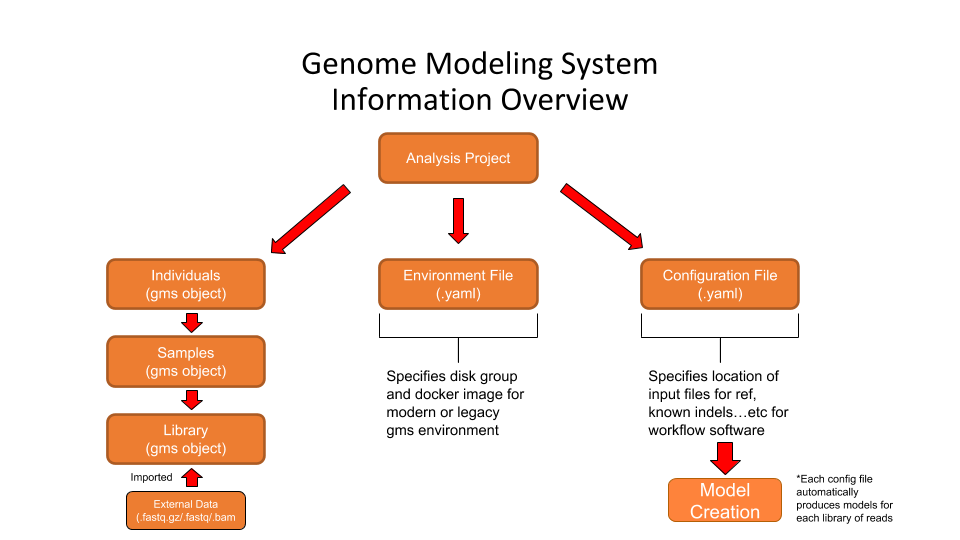

## Create and Configure Analysis Workflow on External Data

Diagram of Genome Modeling System Analysis Project and it's parts. Each analysis project has a configuration file that specifies the processing profile for a specific analysis pipeline, an environment configuration file which specifies the disk group and locations that will be used to output results and store model-data, and individuals that will be used for analysis. The individuals are linked to samples and samples are linked to libraries that contain the location of files on the LIMS system or imported externally (.fastq/.bam).

In this protocol, we will create the analysis project that will eventually be linked to samples for analysis. The GMS was optimized with internal data produced by the LIMS system at WashU. External data is a little harder to work with.

### High Level Overview
1. Create an analysis project-[Project Setup on compute0 (MGI Legacy)](#project-setup-on-compute0-mgi-legacy)
   - add env file specifying disk info
2. Import data-[Importing External Data](#importing-external-data)
   - Create an individual, link them to a sample, link sample to library
   - Use instrument-data to import the library to the project
3. If needed, create a custom processing-profile and configuration-[Creating a Custom Processing Profile](#creating-a-custom-processing-profile)
4. Release the project-[Running a Project](#running-a-project)

### Project Setup on compute0 (MGI Legacy)

Start by invoking the 'modern' gms environment using `gsub` and creating an analysis project.

1. Create an analysis project:

    *Below we are using the --no-config parameter. We have our own lab specific configuration files we will add to the analyis project instead of choosing defaults provided in the gms system.

    #### Using Througly Tested pipeline
    
    1a. If you are using a pipeline that has been throughly tested or is known to run successfully,
    
     ```
     genome analysis-project create --name "Name of Analysis Project Here" --environment prod-builder --no-config
     ```

    #### Pipeline Testing

    1b. If you are testing a new pipeline, it is best to use the ad-hoc environment instead of the prod-builder. This enables more control over the builds (read-write permissions and start/stop builds) and the data that is produced by the experimental pipeline. See below.

     ```
     genome analysis-project create --name "Name of Analysis Project Here" --environment ad-hoc --no-config
     ```
     
2. Check for Environment file .yml file
    
    #### prod-builder environment (default)
    
    2a. If you are using the prod-builder environment, use the jin-lab environment file below:
    
    /gscmnt/gc2698/jin810/analysis-workflows/configuration_files/jinlab_environment_config_prod-builder.yaml

    The file contains the text below

    ```
    disk_group_models: "jin810_gms"
    disk_group_alignments: "jin810_gms"
    lsb_sub_additional: "docker(registry.gsc.wustl.edu/apipe-builder/genome_perl_environment:compute0-24)"
    cwl_runner: cromwell
    workflow_builder_backend: simple
    ```
    #### Ad-hoc environment (for pipeline testing)
    
    2b. If you set up your analysis project to use the ad-hoc environment, use the ad-hoc jin-lab environment file below: 
    
    /gscmnt/gc2698/jin810/analysis-workflows/configuration_files/jinlab_environment_config_user_specfic.yaml
   
    The file contains the text below
        
    ```
     disk_group_models: "jin810_gms"
     disk_group_alignments: "jin810_gms"
     disk_group_scratch: "jin810_gms"
     lsb_sub_additional: "docker(registry.gsc.wustl.edu/apipe-builder/genome_perl_environment:compute0-24)"
     cwl_runner: cromwell
     workflow_builder_backend: simple
     cromwell_server: "hsqldb:tmp"
    ```
    
  Universal Command for either environment chosen:

   ```genome analysis-project add-environment-file "ANALYSIS_PROJ_NAME OR ANALYSIS_PROJ_ID" /gscmnt/gc2698/jin810/configuration_files/$ENV_FILE```

   Where $ENV_FILE is the file based on the environment you chose in step 1 during the analysis-project creation

   *compute1-2 can be used instead of compute0-24 as well if you are using the modern gms image.*

   If using the legacy gms docker image, replace the line with starting with 'lsb_sub_additional' with the line below:

   ```lsb_sub_additional: "docker(registry.gsc.wustl.edu/genome/genome_perl_environment)" ```

3. Add the custom configuration file to the analysis-project. ***NOTE: THIS IS A NECESSARY STEP FOR EXTERNAL DATA***

   Configuration files for specific workflows can be found here: ```/gscmnt/gc2698/jin810/analysis-workflows/configuration_files```

   See the analysis-workflows repo for more specific config files. https://github.com/jinlab-washu/analysis-workflows/configuration_files

   The default GATK4 pipeline to be produce files for downstream joint-calling:

   ```/gscmnt/gc2698/jin810/analysis-workflows/configuration_files/human_germline_exome_bp_gatk4.yml```
   
   Command to add configuration file:
   
   ```
   genome analysis-project add-config-file ANALYSIS_PROJECT_ID /gscmnt/gc2698/jin810/analysis-workflows/configuration_files/human_germline_exome_bp_gatk4.yml
   ```
   
   *IF you are changing the configuration of an analysis project that has already run, use the command below to reprocess the fastq files*
   
    ```
    genome analysis-project add-config-file --reprocess-existing ANALYSIS_PROJECT_ID /gscmnt/gc2698/jin810/analysis-workflows/configuration_files/human_germline_exome_bp_gatk4.yml
    ```

   **This file enables the use of external data that is not in the same format as sequencing data produced internally at WashU. In addition, it changes the processing profile for the Whole-Exome-Sequencing alignment to our custom pipeline so that the emit_reference_confidence (ERC) variable is changed to "BP_RESOLUTION".**
   
   *IF YOU ARE NOT DOING WES-alignment, the "region_of_interest_set_name: xGen Lockdown Exome Panel v1 capture set" line will need to be changed to reflect the regions you will be comparing against and for what type of analysis (WGS or RNA-seq).*

4. Disable the original configuration file (Optional).

   Unless you are analyzing the data with mutliple configuration files (and thus different models), it is best to disable the configuration file you will no longer be using. See command below:
   
   ```
   genome analysis-project disable-config-file --profile-item CONFIG_ID
   ```
   Both configuration files will now show with the command:

   ```genome analysis-project view --fast PROJECT_ID```

   The config files will be lableled based on their status.
   

**Next Step: Import Files and link file to an Analysis Project**

