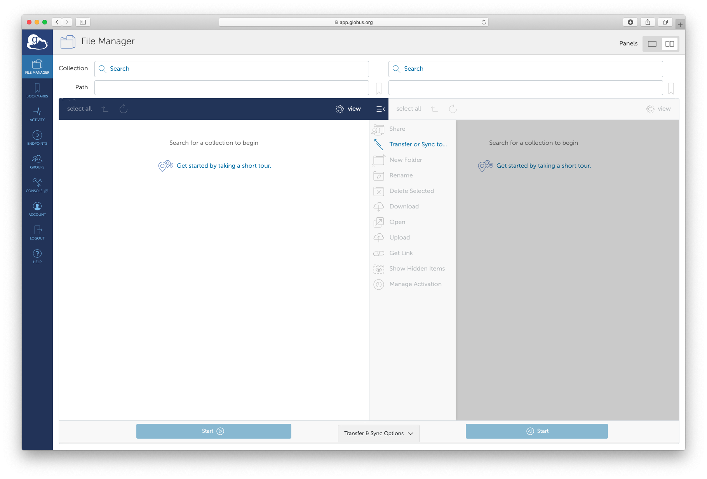
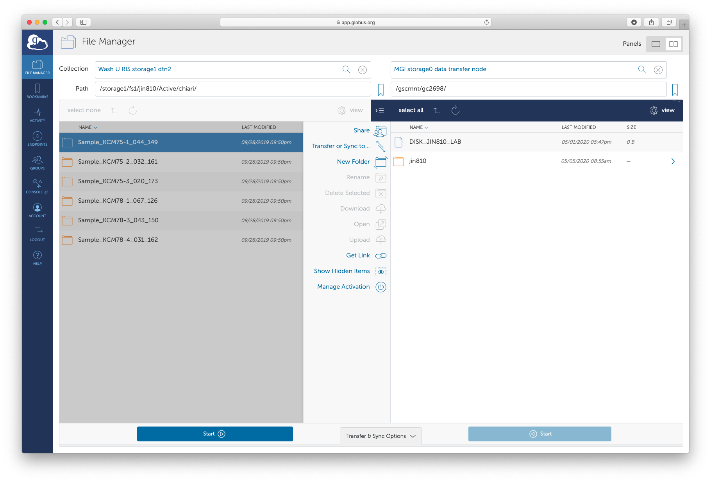
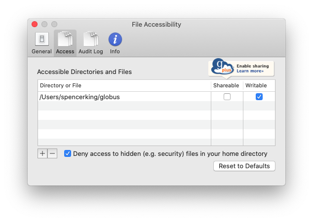

# Globus

## Overview

Globus is a service for accessing and transferring research data. 

## Transferring Data

### Storage1 to Storage0

Transferring data is simple if you are using the Globus web application. First, you will need to select the source and  destination locations. If you are prompted for credentials you should use your WUSTL key and password. On Storage0 you will likely receive a "Permission Denied" message. This is because you do not have access to the root directory. All you need to do is input the path of a directory for which you do have access.

Finally, to transfer a file you just need to select the directory or file you would like to transfer and click on the "Transfer or Sync to..." button. 

### Downloading to your machine

Globus also allows you to download files to your personal machine. To do this you will need to install the Globus Connect Personal application and create an endpoint for your machine. 

*I don't have screenshots because I already did all of this, but if someone could add some that would be great.*

1. In the Globus web application select "ENDPOINTS" in the left menu.
2. Click the "Create a personal endpoint" button and follow the steps.
3. Specify which directories Globus should have access to on your machine.

Files can be transferred in the exact same way as moving to Storage0. The only difference is you will select your machine in the dropdown menu.
