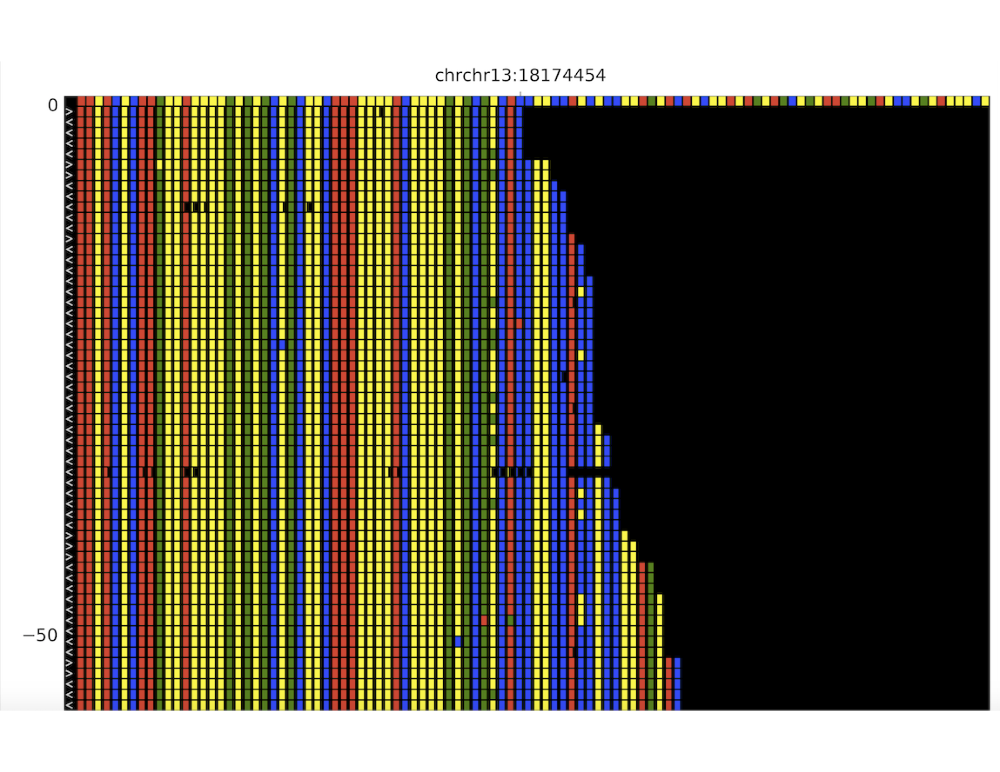

# Variant Visualization with Plot Reads

> Plot Reads was created in Jim Knight's lab at Yale. We have incorporated this program into a docker image to run on the WashU compute clusters.

Requirements:
* Aligned BAM/CRAM
* Chromosome and position for variant visualization

Protocols:
* WashU Compute Clusters
* Yale Ruddle Compute Cluster

## Interactive Protocol

1. Gather list of all chromosomes and positions you want to visualize. Create a text document with each position on a new line.

    Example pos.txt:  
    chr1:5000  
    chr4:80000  
    chr4:457832
    
2. Gather all samples to visualized into a text file with each sample on a new line.
    Example samples.txt
    Sample1
    Sample2
    Sample3
    
3. Submit interactive job to run the plot_reads docker image:

    Compute0:  
    `bsub -Is -q research-hpc -R "select[mem>8000] rusage[mem=8000]" -a 'docker(sam16711/plot_reads:v1)' /bin/bash`

    Compute1:  
    `busb -Is -G compute-jin810 -q general-interactive -M 8GB -R "select[mem>8000 rusage[mem=8000]" -a 'docker(sam16711/plot_reads:v1)' /bin/bash`
    
    Ruddle:
    `tmux new -s plotReads`
    Once in your new window run: `srun --pty -t 4:00:00 --mem=8G -p interactive bash` (Time limits can be modified based on needs)
    Wait for the node to start. Then run the follwing line:
    ``cat samples.txt | while read sample; do cat pos.txt | while read chr pos; do plotReads $chr:$pos $sample;done; done`
    
4. Create image plots at every position in pos.txt for every sample in samples.txt.
    `cat samples.txt | while read sample; do cat pos.txt | while read chr pos; do plotReads $chr:$pos $sample;done; done`
    
    This will output all image plots in the current working directory.
    
    Example image plot below:
    
    
5. Create text plots at every position in pos.txt for every sample in samples.txt.

    This will output all text plots in the current working directory
    
    Example text plot below:
    
