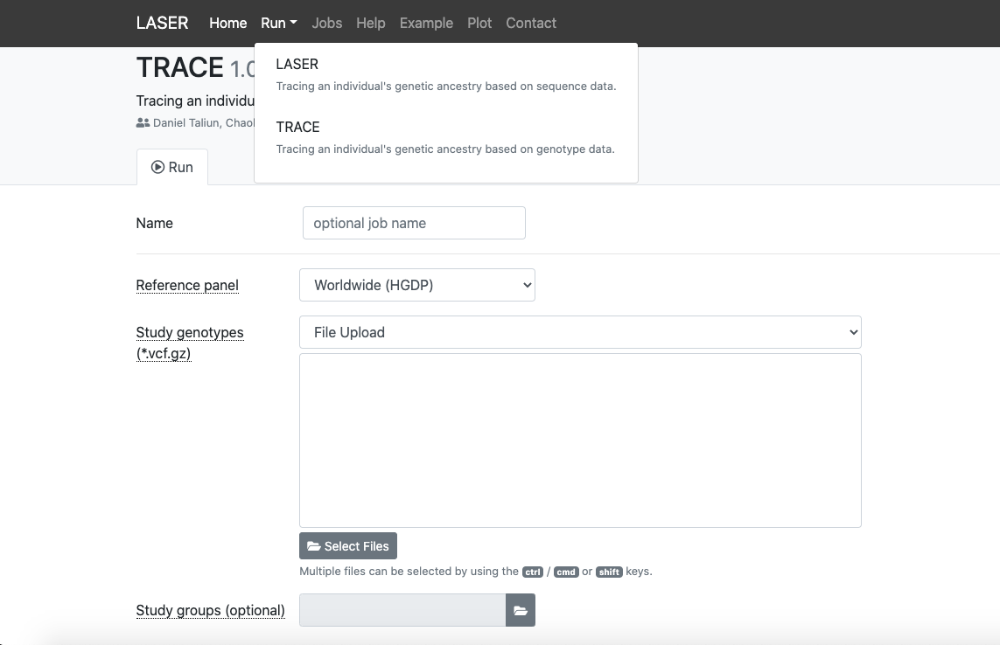

# PCA Analysis Using TRACE (Laser Web Tool)
07-27-2021

This protocol uses the LASER web utility produced at the University of Michigan. 

TRACE is a sub-utility that uses genotype data instead of sequencing data to trace genetic ancestry.

[LASER Server](https://laser.sph.umich.edu/index.html#!run/trace%401.03) - Utility to run pca analysis

[Laser Documentation](http://csg.sph.umich.edu/chaolong/LASER/) - Information Regarding TRACE and LASER pca analysis

## Requirements
- *VCF with genotype calls
  - Jinlab whole exome sequencing pipeline produces this after joint-calling
  - It may use *_vqsr.vcf
  - **SEE NOTES**
- TRACE
  - You will need to create an account in order to run pca analysis on your target vcf
  - After you login, select the TRACE button under dropdown menu labeled "RUN" at the top of the screen.
- USCS Chain file, reference `.fasta`, and reference `.dict` 
  - We have the necessary files for conversion of hg38 to b37 and hg19 to hg38 on compute0
  - See here for downloading chain files: compute1: /storage1/fs1/jin810/Active/references/grch38_to_grch37.over.chain.gz
  
## Notes

Your VCF must have coordinates aligned to b37. b37 is broad insitutes version of GRCh37. hg19 contigs are not compatible.

**If you have a vcf that was aligned to a reference other than b37 (broad institute version of GRCh37), you will have to convert the coordinates to b37. If you used hg19, you will first have to convert to hg38 before b37.**

## Conversion of hg38/h19 to b37
[GATK lift_over vcf site](https://gatk.broadinstitute.org/hc/en-us/articles/360037060932-LiftoverVcf-Picard-#--REFERENCE_SEQUENCE) -This tool adjusts the coordinates of variants within a VCF file to match a new reference. 
1. Call GATK docker
   ```
   bsub -Is -G compute-jin810 -q general-interactive -a 'docker(broadinstitute/gatk:4.1.7.0)' -n 6 -R "select[mem>32GB] rusage[mem=32GB]" /bin/bash
   ```
2. Run LiftoverVcf (Picard) - *3 files were generated: F309_liftover_b37.vcf, F309_liftover_b37.vcf.idx, F309_liftover_rejected_variants.vcf*
   ```
   /gatk/gatk LiftoverVcf \
     --INPUT /storage1/fs1/jin810/Active/yung-chun/demo/parabricks_Trio_demo_prac/F309/F309_VQSR.vcf \
     --OUTPUT /storage1/fs1/jin810/Active/yung-chun/demo/parabricks_Trio_demo_prac/F309/F309_liftover_b37.vcf \
     --CHAIN /storage1/fs1/jin810/Active/references/grch38_to_grch37.over.chain \
     --REJECT /storage1/fs1/jin810/Active/yung-chun/demo/parabricks_Trio_demo_prac/F309/F309_liftover_rejected_variants.vcf \
     --REFERENCE_SEQUENCE /storage1/fs1/jin810/Active/references/Homo_sapiens_assembly19.fasta
   ```
 3. GZIP the output.vcf file
   ```
   gzip -c {file} > {file.gz}    # "-c" means to keep the original file
   ```
   - for un-gzip file
   ```
   gzip -dc {file.gz} > {file}
   gunzip -c {file.gz} > {file}
   ```

   - Differences between GRCh37 builds: [GRCh37 Builds and their Naming Conventions](https://gatk.broadinstitute.org/hc/en-us/articles/360035890711-GRCh37-hg19-b37-humanG1Kv37-Human-Reference-Discrepancies) *The naming convention of hg19 and hg38 differs from b37.

   *There doesn't seem to be a chain file that converts hg19 to b37 coordinates. If your vcf was produced with alignment to hg19, you will have to do two liftOvers.*
     - Liftover hg19 to hg38
     - Liftover hg38 to b37

## Globus to transfer the data from WashU server to local computer
 [Globus wesite](https://www.globus.org)- This tool is for transferring data stored in WashU server (compute1)
 1. Use WahU account to log in
 2. Install globus on local computer and connect to globus
 


## Protocol

1. Create an account (if you have not already done so)

2. Click the run tab at the top of the screen and select TRACE from the dropdown menu

3. Give your job a name and upload the vcf. 
  - If you would like to visualize groups of variants, you can create a "study groups" file and upload it. If you do this, **EVERY** individual in the study must have a group. See the website instructions for more information on the format.
## TRACE tool on Laser Website
 
 1. Make sure the .vcf file has benn zipped to .vcf.gzip
 2. Change the number of principal components from 3 to 10. 
    - This increases the number of ways the data can be visualized. Sometimes ethnicities overlap and it is hard to determine which background a sample belongs too. By increasing the number of principal components, you can separate closely populated ethnicities by displaying different variations of the principal components (e.g. PC1 vs PC7 instead of PC1 vs PC2)
 3. Submit the job by clicking the button at the bottom of the screen. This can take up to several hours to run, depending upon the size of your vcf and number of individuals in the study.
 4. Results of your study can viewed by selecting the "Jobs" tab at the top of the screen. Then select job of interest.
 
