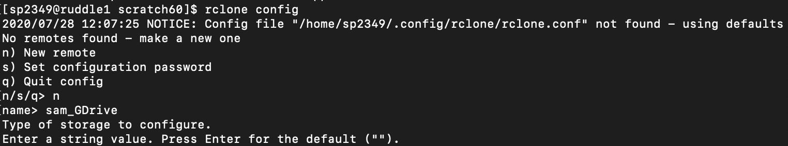

# Transferring files from Google Drive Using RClone

Notes:
    
- There are two protocols below for the clusters we use in lab. One is for the yale cluster and one is for the WashU cluster. The major difference between the two is the WashU protocol uses a docker image and the yale protocol does not.
    
- You will need to have access to both the WashU and Yale vpn
    
    - See here for downloading Cisco anyconnect for VPN service: https://vpn.net.wustl.edu/+CSCOE+/logon.html#form_title_text


# Yale Ruddle Protocol

1. ssh into the yale ruddle hpc
    
    **If you have not set up ssh for the ruddle hpc yet, see here: https://docs.ycrc.yale.edu/clusters-at-yale/access/**
    
    
2. Load the Rclone module

    Command: ```module load rclone```
  
3. Create a new rclone config for your google drive account

    Command: ```rclone config```
    
    *See here for more details: https://rclone.org/drive/*
  
4. Select n for new remote and name the new drive.

    

5. (Optional) Create a client id and secret according to the following page: https://rclone.org/drive/#making-your-own-client-id 

    Creating a client id and secret improves performance, but is not necessary.
    
6. Enter client id and secret (if applicable)

7. Enter value for acess type from selection that appears.

    E.g. 1-Full access

8. Leave blank for "root_folder_id" and "service_account_file" (unless you know what you are doing)

9. Select ```n``` for edit advanced config (unless you know what you are doing)

10. Select ```n``` for remote config as we are working on a headless machine

    - A link will appear in order to authorize access for rclone to your google drive account. Click the link and authorize access.
    
11. Select ```n``` for ```Configure this as a team drive```

12. Check overview of drive information and select ```y``` if it looks okay.

Now you should be able to use rclone commands to transfer files to hpc clusters or local locations via the command line
