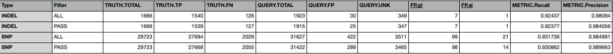

# Two Step Protocol

This is a two step protocol that produces vcf files ready for downstream varaint analysis using the GATK4 joint-calling best practices pipline. 
- 1st Step: Creates merged gvcf files for each sample using the Genome Modeling System at WashU. 
- 2nd Step: Creates a joint-called vcf file for all samples in the cohort ready for downstream variant analysis. 

### Notes

- **Protocol written for use with WashU Compute0.
- Protocol uses a modified bed file with genomic intervals + ~100bp padding in 5' and 3' direction for the IDT's xGen Lockdown Exome Panel v1 capture set and unpadded nextera rapid capture and expanded exome intervals for benchmarking. 
  - See here for bed file: [jin-lab_exome_targets_annotated.bed](./bed_files/jin_lab_exome_targets_annotated.bed)
  - See here for instructions to create a modified bed file for custom genomic intervals

### Protocol

1. Fastq/Bam to merged gvcf pipeline

  - 1a. Create an analysis project using the GMS and using the procotol found here.  
  [Create and Configure Analysis Project](https://github.com/jinlab-washu/Jin-lab.manual/blob/master/Genome_Modeling_System/create_analysis_project_GMS.md)
  - 1b. Import external data if necessary
    * If you are using external data not generated at WashU, you will need to import the external data. See the protocol here: [Import External Data](https://github.com/jinlab-washu/Jin-lab.manual/blob/master/Genome_Modeling_System/import_external_data_manually.md)
  - 1c. Add instrument data to analysis project  
  - 1d. Release the project for analysis
    `genome analysis-project release $analysis_project_id`

2. Once finished, run the joint-calling pipeline using the analysis project id created from step 1a.
    
    *NOTE: If you have more than one build per sample with results, please see the in-depth protocol found here:* [Joint-Call Genotyping In Depth](./exome_jointcall_hg38_in-depth.md) Typically, this only happens when a run fails or you are testing a new pipeline. If you did not re-run your target analysis project, you should be able to continue.

    **Ensure you are logged into the gms environment on compute0 with the command:** ```gsub```
  
   Run the following command to launch Joint-Call Genotyping:
   
   [computer0]
   
    ```/gscmnt/gc2698/jin810/analysis-workflows/bash_scripts/get_input_and_run_jointcall_exome_hg38.sh $ANALYSIS_ID```
    
    [computer1]
    
    ```/storage1/fs1/jin810/Active/analysis-workflows/bash_scripts/get_input_and_run_jointcall_exome_hg38.sh $ANALYSIS_ID```


## Current Benchmarking Results

Current Benchmarking Results with NIST NA12878

Fastq from NIST NA12878 Garvan found here:
https://github.com/genome-in-a-bottle/giab_data_indexes/blob/master/NA12878/sequence.index.NA12878_Illumina_HiSeq_Exome_Garvan_fastq_09252015

Capture Set for Benchmarking: nextera rapid cature and expanded exome


